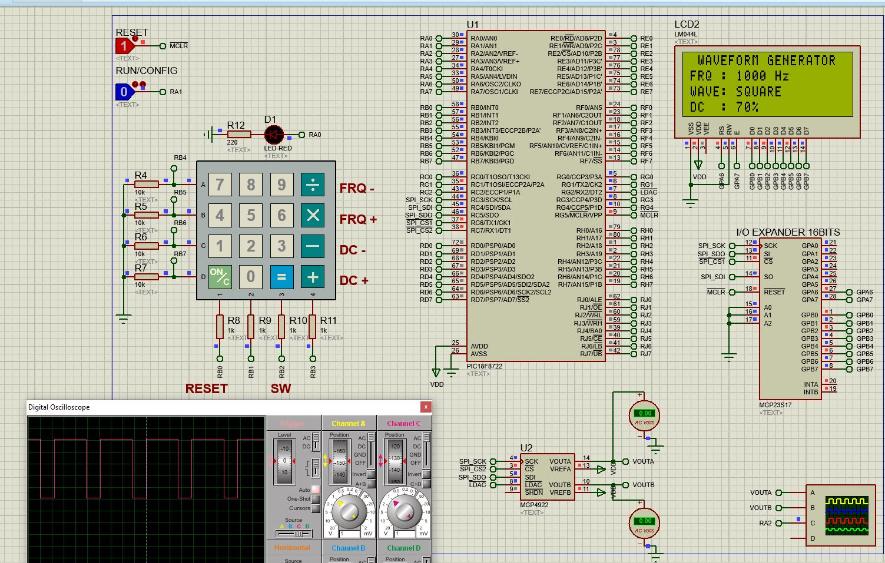

# Signal Generator (C)
Signal waveform generator in C

School project consisting in the creation of an analogic signal waveform generator. The program allows to customize the signal type (square, ramp and triangle), the frequency and the duty cycle.

## Components 
* Microcontroller PIC18F8722
* Digital-to-Analog Converter MCP4922
* LCD 20x4 LM044L
* I/O Expander 16 bits MCP23S17
* 16-Button Numeric Keypad

## Environment
* MPLABX v5.40
* Proteus 8

### Example

